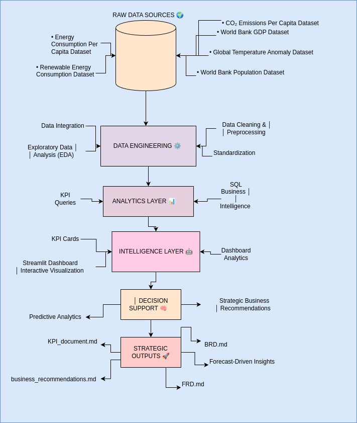
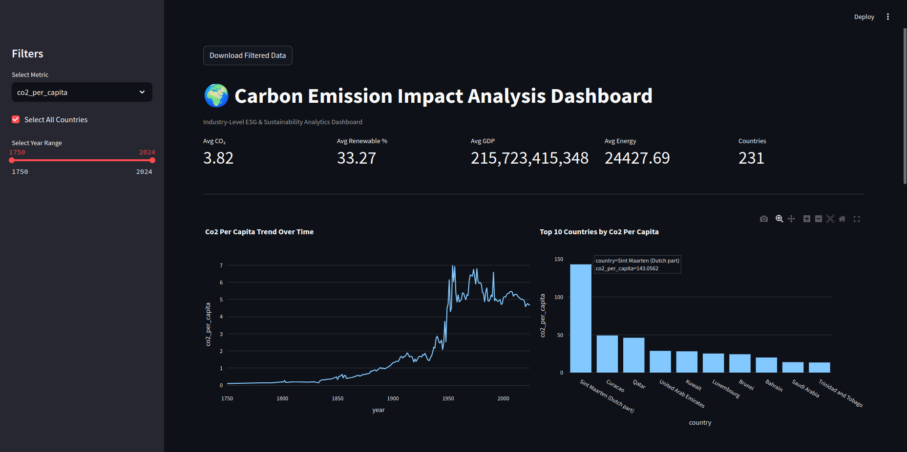
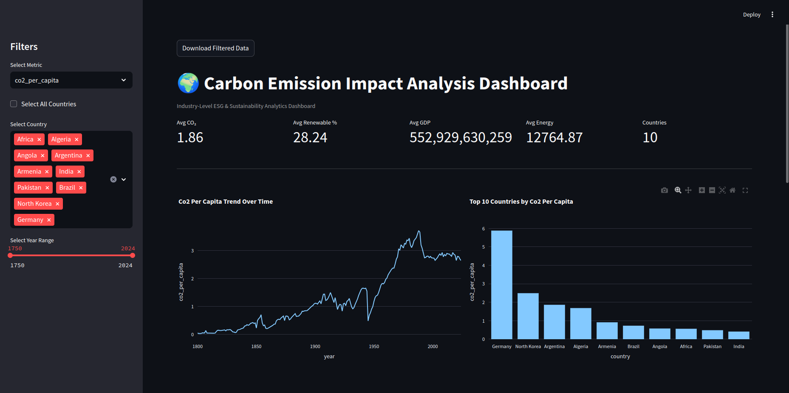

# 🌍 Carbon Emission Impact Analysis & Sustainability Intelligence Platform

An end-to-end ESG analytics project focused on analyzing global carbon emissions, renewable energy adoption, energy consumption, population trends, and economic growth to generate sustainability intelligence and strategic business insights.

---

# Project Overview

The Carbon Emission Impact Analysis project is a sustainability analytics platform designed to transform fragmented environmental and economic datasets into actionable ESG intelligence.

This solution integrates:

- Data Engineering
- Exploratory Data Analysis (EDA)
- SQL Business Intelligence
- KPI Analytics
- Predictive Forecasting
- Interactive Dashboarding
- Business Documentation
- Dockerized Deployment

The platform enables decision-makers to understand environmental performance, identify sustainability leaders, forecast future emissions, and support data-driven ESG strategies.

---

# Business Problem

Climate change and carbon emissions have become major global strategic concerns.

Organizations, governments, and ESG stakeholders often face challenges such as:

- Limited visibility into carbon emission patterns
- Fragmented environmental datasets
- Difficulty measuring renewable energy effectiveness
- Weak sustainability benchmarking
- Limited forecasting for climate planning
- Lack of centralized sustainability dashboards

This project addresses these challenges through an integrated sustainability intelligence platform.

---

# Project Objectives

The key objectives of this project are:

- Analyze global carbon emission trends
- Measure renewable energy impact on emissions
- Study GDP vs environmental performance
- Evaluate energy consumption patterns
- Benchmark sustainability leaders
- Build executive KPI dashboards
- Perform SQL business analysis
- Forecast future carbon emissions
- Deliver strategic ESG recommendations

---

# Architecture Diagram



---

# Tech Stack

## Programming & Analytics
- Python
- Pandas
- NumPy
- Matplotlib
- Plotly
- Scikit-learn
- XGBoost

## Dashboard & Visualization
- Streamlit
- Plotly Express

## Database
- SQLite

## Deployment
- Docker
- Docker Compose

## Documentation
- Markdown
- GitHub

---

# Dataset Sources

The project uses multiple environmental and economic datasets:

- CO₂ Emissions Per Capita Dataset
- World Bank GDP Dataset
- World Bank Population Dataset
- Renewable Energy Consumption Dataset
- Energy Consumption Per Capita Dataset
- Global Temperature Anomaly Dataset

---

# Project Structure
```bash
carbon-emission-analysis/
│
├── data/
│   ├── raw/
│   └── processed/
│       ├── final_dataset.csv
│       └── carbon.db
│
├── notebooks/
│   ├── eda/
│   │   ├── 01_data_cleaning.ipynb
│   │   ├── 02_eda.ipynb
│   │   └── 03_sql_analysis.ipynb
│   │
│   └── forecasting/
│       └── 04_forecasting.ipynb
│
├── dashboard/
│   └── streamlit/
│       └── app.py
│
├── documents/
│   ├── BRD.md
│   ├── FRD.md
│   ├── KPI_document.md
│   └── business_recommendations.md
│
├── docker/
│   ├── Dockerfile
│   └── docker-compose.yml
│
├── screenshots/
├── requirements.txt
├── README.md
└── .gitignore
```

---

# Key Business Questions

This project addresses the following strategic questions:

1. Which countries have the highest carbon emissions?
2. Does renewable energy reduce carbon emissions?
3. What is the relationship between GDP and CO₂ emissions?
4. Which countries demonstrate sustainability leadership?
5. How does energy consumption impact emissions?
6. Which factors most strongly drive carbon emissions?
7. Can future carbon emissions be predicted?

---

# Dashboard Screenshots

## Executive Dashboard



## Sustainability Analysis


## Economic Impact Analysis


## Global Emission Map


---

# SQL Analysis Highlights

Business intelligence queries performed:

- Top emitting countries
- Sustainability leader identification
- Renewable energy ranking
- GDP vs carbon analysis
- Energy consumption trend analysis

Example outputs:


---

# Forecasting Models

Predictive models used:

- Linear Regression
- Random Forest Regressor
- XGBoost Regressor
- ARIMA (optional future enhancement)

Evaluation Metrics:

- Mean Absolute Error (MAE)
- Root Mean Squared Error (RMSE)
- R² Score

Forecasting outputs:


Feature importance:


---

# Business Documentation

This project includes consulting-style business documentation:

- BRD (Business Requirements Document)
- FRD (Functional Requirements Document)
- KPI Executive Handbook
- ESG Strategy Recommendations

Documents located in:

```bash
documents/
```

---

# Docker Deployment

Build Docker image:

```bash
docker build -f docker/Dockerfile -t carbon-dashboard .
```

Run container:

```bash
docker run -p 8501:8501 carbon-dashboard
```

Access dashboard:

```bash
http://localhost:8501
```

---

# How to Run Locally

## Clone Repository

```bash
git clone <your_repo_url>
cd carbon-emission-analysis
```

## Create Virtual Environment

```bash
python3 -m venv .venv
source .venv/bin/activate
```

## Install Dependencies

```bash
pip install -r requirements.txt
```

## Run Dashboard

```bash
streamlit run dashboard/streamlit/app.py
```

---

# Strategic Recommendations

Based on the analysis:

- Increase renewable energy investment
- Reduce fossil fuel dependency
- Improve industrial energy efficiency
- Benchmark sustainability leaders
- Implement ESG KPI monitoring
- Use predictive forecasting for climate planning
- Support sustainable economic growth

---

# Future Enhancements

Potential next-phase improvements:

- Real-time ESG monitoring
- API-based live data ingestion
- Cloud deployment
- Role-based dashboard access
- Industry-specific ESG benchmarking
- Advanced anomaly detection
- Net Zero readiness scoring

---

# Author

**Ajanya M**

Data Analytics | ESG Analytics | Business Intelligence | Machine Learning

---

# Project Value

This project demonstrates:

✅ Data Engineering  
✅ Business Analysis  
✅ ESG Analytics  
✅ SQL Analytics  
✅ Predictive Modeling  
✅ Dashboard Development  
✅ Docker Deployment  
✅ Strategic Documentation